# ShortLongMemory Bot — Документация проекта

Проект реализует три Telegram-бота с разными типами памяти на базе aiogram 3.x и OpenAI-совместимых API.

---

## Структура проекта

```
ShortLongMemory_bot/
├── bot_short_memory.py       # Бот с короткой памятью
├── bot_long_memory.py        # Бот с долгой памятью (RAG)
├── bot_shortlong_memory.py   # Универсальный бот (выбор режима)
├── ai_direct.py              # CLI-интерфейс для работы с AI
├── openai_client.py          # Унифицированный OpenAI-клиент
├── .env                      # API-ключи и токены
├── requirements.txt          # Зависимости
├── memory/                   # ChromaDB persistent storage
└── uploads/                  # Загруженные пользователями файлы
```

---

## Быстрый старт

```bash
python -m venv venv
venv\Scripts\activate          # Windows
# source venv/bin/activate     # Linux/macOS

pip install -r requirements.txt
pip install chromadb pypdf python-docx aiohttp --prefer-binary

python bot_shortlong_memory.py   # универсальный бот
# или
python bot_short_memory.py
python bot_long_memory.py
```

---

## Конфигурация (.env)

```env
BOT_TOKEN=your-telegram-bot-token

ZAI_API_KEY=your-zai-key
PROXY_API_KEY=your-proxyapi-key
GEN_API_KEY=your-genapi-key

EMBED_MODEL=text-embedding-3-small   # опционально
```

---

## Провайдеры и модели

Все три бота используют одинаковую структуру провайдеров:

| Провайдер       | Переменная      | URL                                  |
|-----------------|-----------------|--------------------------------------|
| Z.AI            | ZAI_API_KEY     | https://api.z.ai/api/paas/v4/        |
| ProxyAPI        | PROXY_API_KEY   | https://api.proxyapi.ru/openai/v1    |
| GenAPI          | GEN_API_KEY     | https://proxy.gen-api.ru/v1          |

### Чат-модели Z.AI
| Модель        | Бесплатно | Макс. токенов | Температура |
|---------------|-----------|---------------|-------------|
| GLM-4.7-Flash | ✅        | 4 096         | 0.0–1.0     |
| GLM-4.5-Flash | ✅        | 4 096         | 0.0–1.0     |
| GLM-4.7       | ❌        | 8 192         | 0.0–1.0     |
| GLM-4.5       | ❌        | 8 192         | 0.0–1.0     |

### Чат-модели ProxyAPI
| Модель       | Макс. токенов | Температура |
|--------------|---------------|-------------|
| GPT-4.1 Nano | 32 768        | 0.0–2.0     |
| GPT-4.1 Mini | 32 768        | 0.0–2.0     |
| GPT-4.1      | 32 768        | 0.0–2.0     |
| GPT-4o Mini  | 16 384        | 0.0–2.0     |
| GPT-4o       | 16 384        | 0.0–2.0     |

### Чат-модели GenAPI
| Модель            | Макс. токенов | Температура |
|-------------------|---------------|-------------|
| GPT-4.1 Mini      | 32 768        | 0.0–2.0     |
| GPT-4.1           | 32 768        | 0.0–2.0     |
| GPT-4o            | 16 384        | 0.0–2.0     |
| Claude Sonnet 4.5 | 8 192         | 0.0–1.0     |
| Gemini 2.5 Flash  | 8 192         | 0.0–2.0     |
| DeepSeek Chat     | 8 192         | 0.0–2.0     |
| DeepSeek R1       | 16 000        | 0.0–2.0     |

### Модели эмбеддингов (для долгой памяти)
| Провайдер | Модели                                                          |
|-----------|-----------------------------------------------------------------|
| Z.AI      | embedding-3, embedding-2                                        |
| ProxyAPI  | text-embedding-3-small, text-embedding-3-large, ada-002         |
| GenAPI    | text-embedding-3-small, text-embedding-3-large, ada-002         |

---

## Описание ботов

### bot_short_memory.py — Короткая память

Хранит последние 10 сообщений диалога в оперативной памяти.

Команды: `/start` `/config` `/new` `/info`

### bot_long_memory.py — Долгая память (RAG)

Индексирует загруженные документы через эмбеддинги в ChromaDB. Отвечает строго по документу.

Команды: `/start` `/config` `/docs` `/clear` `/info`

### bot_shortlong_memory.py — Универсальный бот

После `/start` предлагает выбрать режим:
- 💬 Короткая память
- 📚 Долгая память
- 🧠 Короткая + Долгая память

Команды: `/start` `/config` `/new` `/docs` `/clear` `/info`

---

## Архитектура памяти

### Короткая память

```
RAM: Dict[user_id, deque(maxlen=10)]

Каждое сообщение: {"role": "user"|"assistant", "content": "..."}

Жизненный цикл:
  - Создаётся при первом сообщении
  - Очищается командой /new
  - Сбрасывается при перезапуске бота
```

### Долгая память

```
ChromaDB (./memory/) — persistent vector store

Каждый чанк:
  - id:       "user_id:doc_id:chunk_index"
  - document: текст чанка (~500 символов)
  - embedding: вектор float[] (размерность зависит от модели)
  - metadata: {user_id, doc_id, chunk_index}

Жизненный цикл:
  - Создаётся при загрузке документа
  - Сохраняется между перезапусками
  - Удаляется командой /clear
```

### Комбинированная память

```
Короткая: deque(maxlen=10) в RAM
Долгая:   ChromaDB (persistent)

При запросе:
  1. Поиск в ChromaDB → top-5 чанков
  2. История из deque
  3. Объединение в один prompt → модель
```

---

## Диаграммы

> Mermaid-версии рендерятся прямо на GitHub. PlantUML-версии можно использовать локально или через [plantuml.com](https://www.plantuml.com/plantuml/uml/).

### Диаграмма 1: Архитектура системы

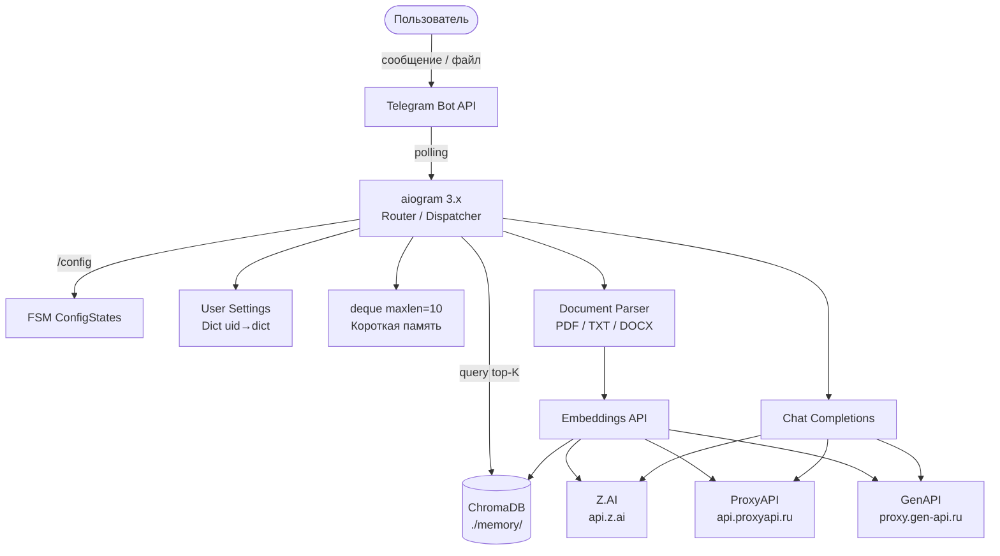

<details>
<summary>PlantUML</summary>

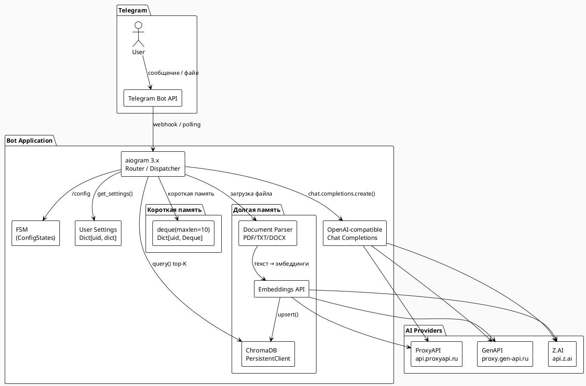

</details>

---

### Диаграмма 2: Поток обработки сообщения — Короткая память

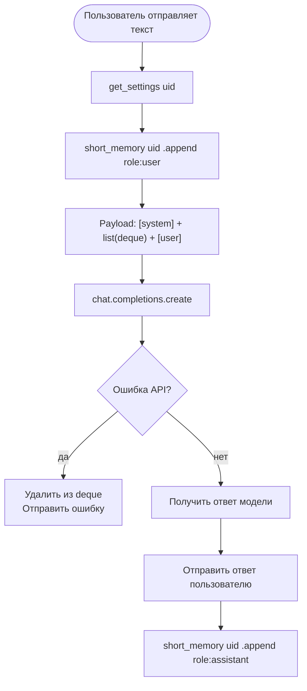

<details>
<summary>PlantUML</summary>

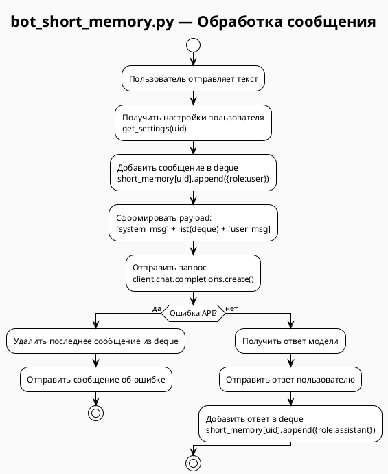

</details>

---

### Диаграмма 3: Поток обработки документа и вопроса — Долгая память

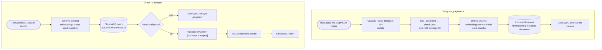

<details>
<summary>PlantUML</summary>

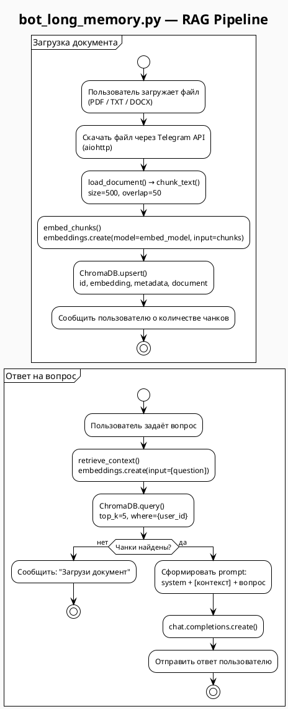

</details>

---

### Диаграмма 4: Комбинированный пайплайн — Короткая + Долгая память

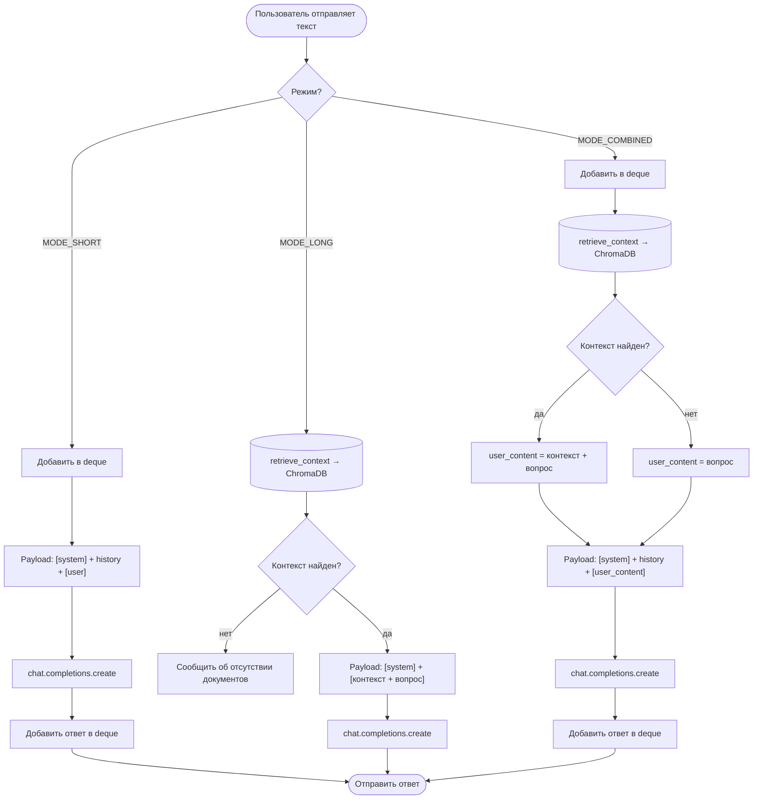

<details>
<summary>PlantUML</summary>

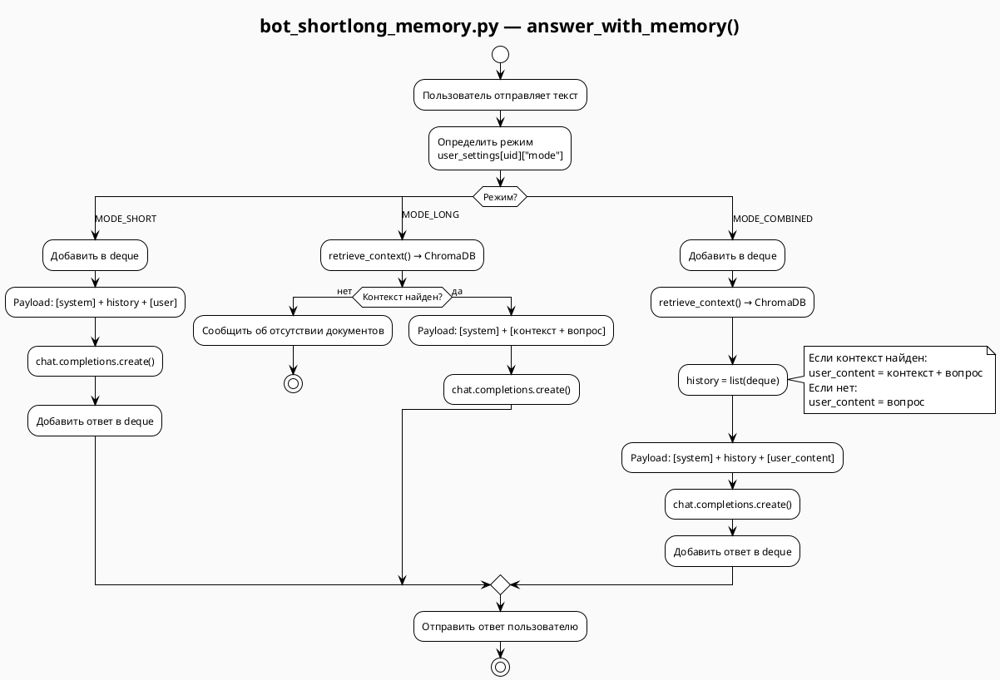

</details>

---

### Диаграмма 5: FSM — Настройка /config

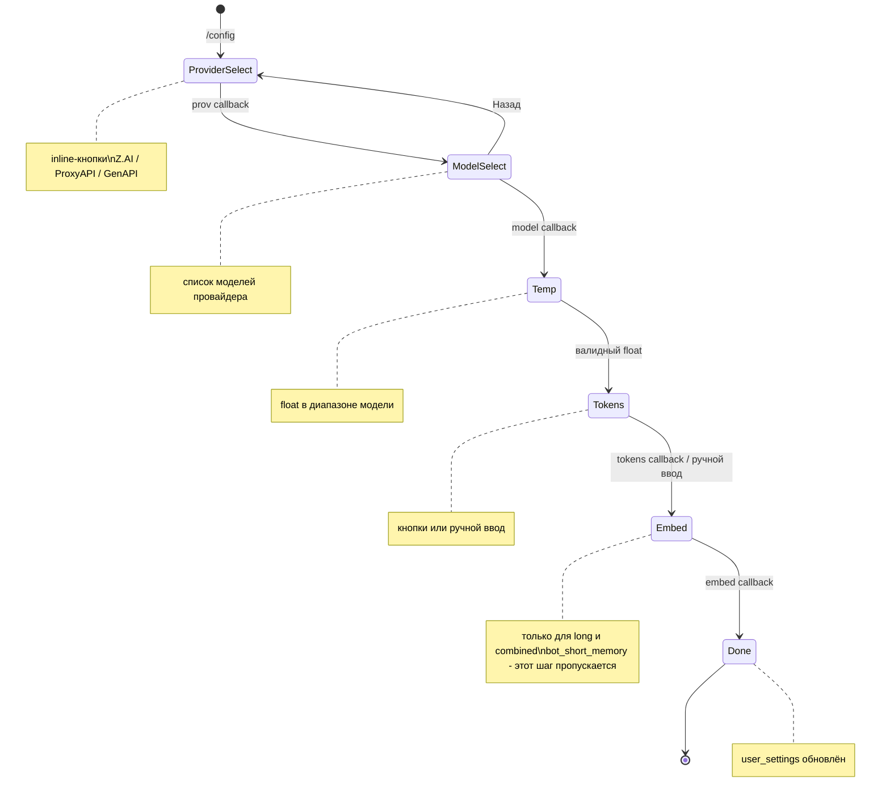

<details>
<summary>PlantUML</summary>

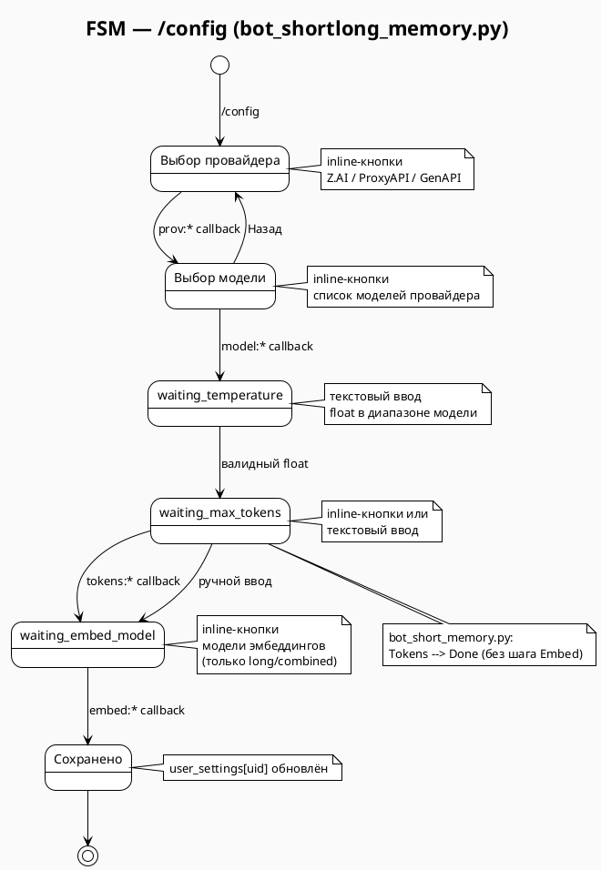

</details>

---

### Диаграмма 6: Структура памяти в ChromaDB

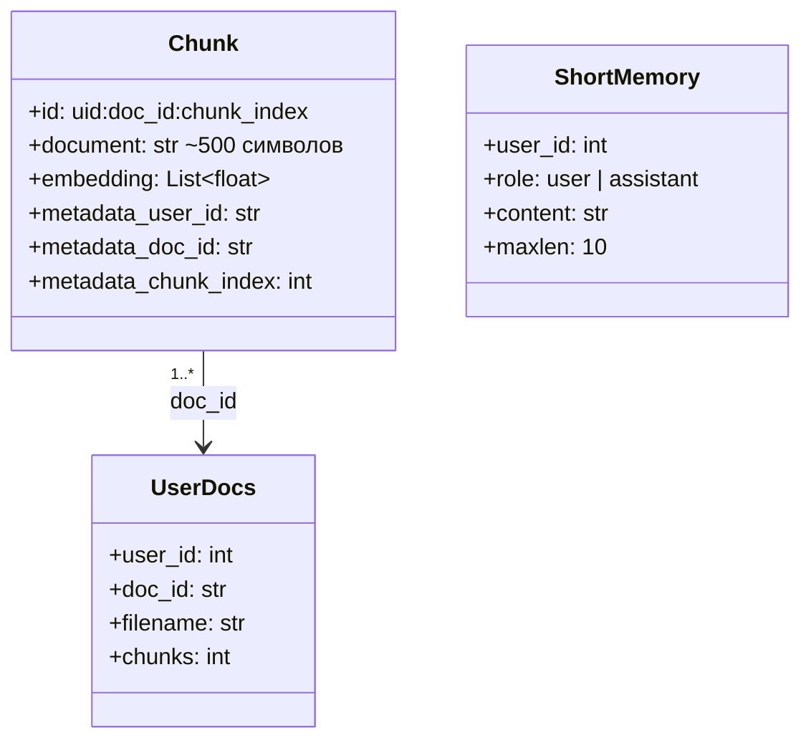

<details>
<summary>PlantUML</summary>

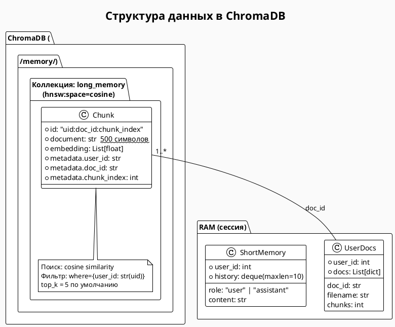

</details>

---

### Диаграмма 7: Выбор режима после /start

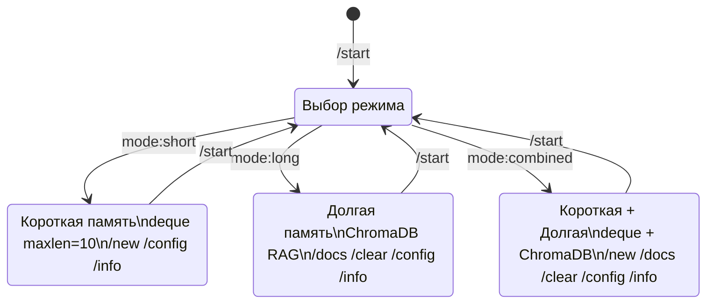

<details>
<summary>PlantUML</summary>

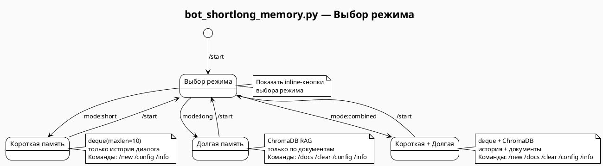

</details>

---

## Как работает каждый тип памяти

### Короткая память

Реализована через `collections.deque(maxlen=10)` — кольцевой буфер в оперативной памяти.

Библиотеки: `collections` (stdlib)

Хранение: только в RAM, не персистентна.

Логика запроса:
```
[system_prompt]
[user msg N-9]
[assistant msg N-9]
...
[user msg N]   ← текущий вопрос
```
Модель видит контекст последних 10 реплик. При переполнении старые сообщения автоматически вытесняются.

Очистка: `/new` — `deque.clear()`

---

### Долгая память

Реализована через ChromaDB — локальную векторную базу данных с HNSW-индексом.

Библиотеки: `chromadb`, `openai` (embeddings), `pypdf`, `python-docx`, `aiohttp`

Хранение: персистентно в папке `./memory/`, сохраняется между перезапусками.

Логика индексации:
```
Файл → load_document() → chunk_text(size=500, overlap=50)
     → embeddings.create(model, input=chunks)
     → ChromaDB.upsert(ids, embeddings, metadatas, documents)
```

Логика поиска:
```
Вопрос → embeddings.create(model, input=[question])
       → ChromaDB.query(query_embeddings, n_results=5, where={user_id})
       → top-5 чанков по cosine similarity
```

Логика запроса к модели:
```
[system: "Отвечай только по контексту"]
[user: "Контекст:\n{chunks}\n\nВопрос: {question}"]
```

Очистка: `/clear` — `ChromaDB.delete(ids)` для всех чанков пользователя.

---

### Комбинированная память

Объединяет оба подхода в функции `answer_with_memory()`.

Логика запроса:
```
[system: "Используй документ и историю"]
[user msg N-9]          ← короткая память
[assistant msg N-9]
...
[user: "Контекст:\n{chunks}\n\nВопрос: {question}"]  ← долгая память + текущий вопрос
```

Приоритет: если в ChromaDB найдены релевантные фрагменты — они включаются в запрос. Если нет — запрос идёт только с историей диалога.

---

## Зависимости

```
aiogram>=3.7.0
openai>=1.0.0
python-dotenv
chromadb
pypdf
python-docx
aiohttp
```
